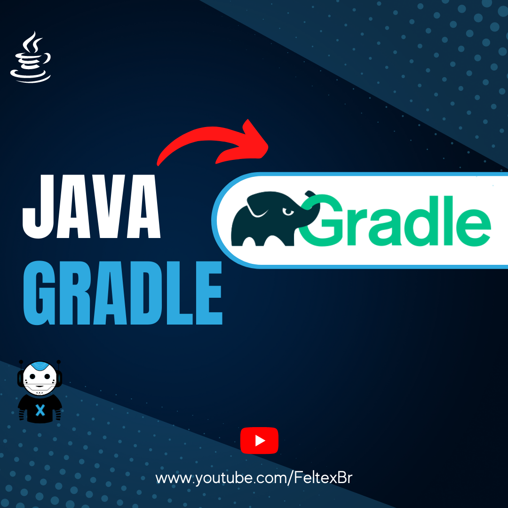

# utilizando-gradle
O gradle é uma ferramenta de automação de builds baseada tanto no Apache Maven quanto no Ant.

A saber o Gradle é o gerenciador de dependência oficial do Android.

## 📺 Link dos vídeos

 - [Utilizando Grade](https://youtu.be/YABbY3JVMmM)
